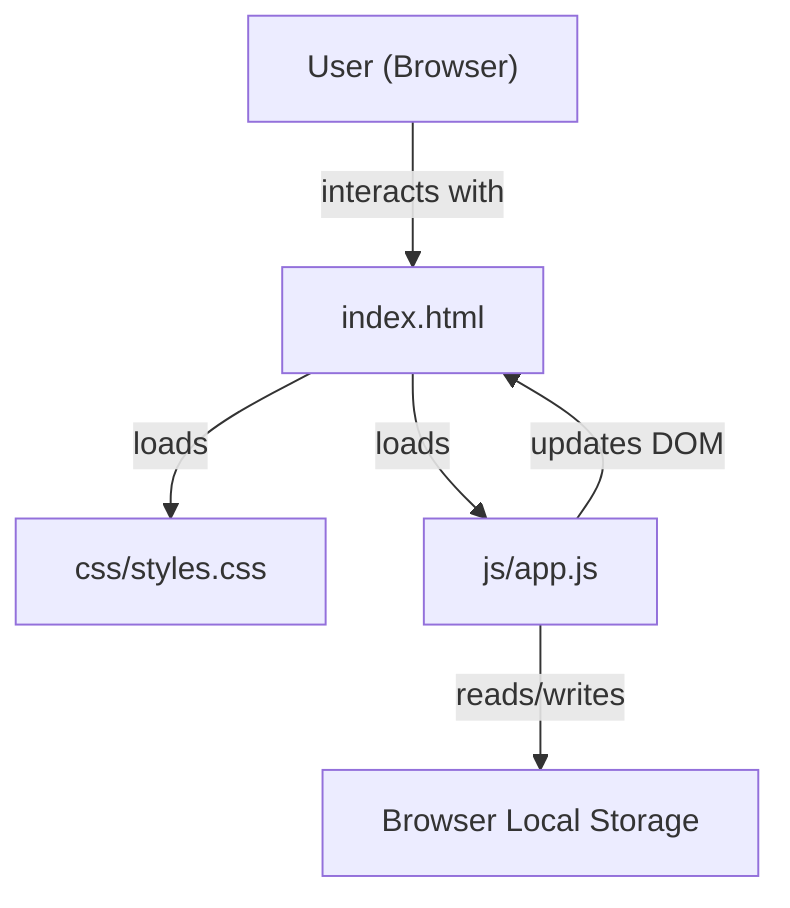
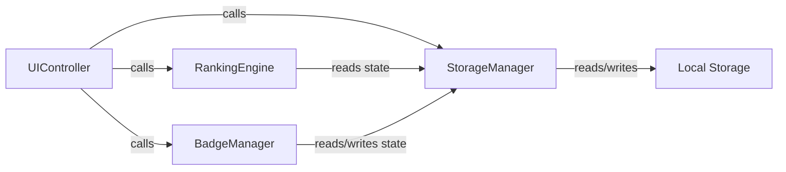

# Design Document: Leaderboard Website

## Overview

The Leaderboard Website is a fully client-side web application built with plain HTML, CSS, and Vanilla JavaScript. It tracks student rankings based on points, supports badge assignment, and persists all data in the browser's Local Storage API. There is no backend, no build step, and no external dependencies — the application runs directly in any modern browser by opening `index.html`.

The design follows a modular JavaScript architecture within a single file (`js/app.js`), where each logical concern (storage, ranking, badges, UI) is encapsulated in a plain-object module. A single CSS file (`css/styles.css`) handles all visual styling.

### Key Design Decisions

- **Single JS file, module pattern**: All JavaScript lives in `js/app.js`. Logical separation is achieved through named module objects (`StorageManager`, `RankingEngine`, `BadgeManager`, `UIController`) rather than ES modules or classes, ensuring maximum browser compatibility without a bundler.
- **No frameworks**: Vanilla DOM APIs only. This keeps the bundle size at zero and avoids any dependency management.
- **Local Storage as the source of truth**: Every mutation writes to Local Storage immediately. On page load, state is hydrated from Local Storage.
- **Synchronous rendering**: All DOM updates happen synchronously after state changes, keeping UI feedback well within the 100ms requirement.

---

## Architecture



### Module Interaction



### Data Flow

1. **User action** (click, form submit) → `UIController` event handler
2. `UIController` mutates in-memory state array
3. `StorageManager.save()` serializes state to Local Storage as JSON
4. `RankingEngine.sort()` re-orders the in-memory array by points descending
5. `UIController.render()` rebuilds the DOM from the sorted state
6. Visual highlights and badges are applied during render

---

## Components and Interfaces

### StorageManager

Responsible for reading and writing the student list to Local Storage.

```javascript
StorageManager = {
  STORAGE_KEY: 'leaderboard_students',

  // Returns parsed array of StudentEntry objects, or [] if nothing stored
  load(): StudentEntry[],

  // Serializes students array to JSON and writes to Local Storage
  save(students: StudentEntry[]): void,

  // Clears all leaderboard data from Local Storage
  clear(): void
}
```

### RankingEngine

Responsible for sorting students and computing rank positions.

```javascript
RankingEngine = {
  // Returns a new array sorted by points descending (stable sort for ties)
  sort(students: StudentEntry[]): StudentEntry[],

  // Returns the 0-based rank index of a student by id in a sorted array
  getRank(students: StudentEntry[], id: string): number
}
```

### BadgeManager

Responsible for badge assignment and removal logic.

```javascript
BadgeManager = {
  AVAILABLE_BADGES: string[],  // e.g. ['⭐', '🏆', '🎯', '🔥', '💡']

  // Returns updated student with badge added (no-op if already present)
  addBadge(student: StudentEntry, badge: string): StudentEntry,

  // Returns updated student with badge removed
  removeBadge(student: StudentEntry, badge: string): StudentEntry
}
```

### UIController

Responsible for all DOM interactions, event binding, and rendering.

```javascript
UIController = {
  // Initializes event listeners and renders initial state
  init(): void,

  // Rebuilds the entire student list DOM from sorted state
  render(students: StudentEntry[]): void,

  // Renders a single student row element
  renderStudentRow(student: StudentEntry, rank: number): HTMLElement,

  // Shows an error message in the designated error area
  showError(message: string): void,

  // Clears any displayed error message
  clearError(): void,

  // Updates the header date display
  updateDate(): void
}
```

### Application State

A single module-level array `state.students` holds all `StudentEntry` objects in memory. All mutations go through helper functions that update state, persist to storage, re-sort, and re-render.

```javascript
const state = {
  students: []  // StudentEntry[]
}
```

---

## Data Models

### StudentEntry

The core data object representing a student on the leaderboard.

```javascript
{
  id: string,        // UUID v4, generated at creation time
  name: string,      // Display name, must be unique and non-empty
  points: number,    // Integer, starts at 0, can be negative
  badges: string[]   // Array of badge strings (emoji or short text)
}
```

**Example:**
```json
{
  "id": "a1b2c3d4-e5f6-7890-abcd-ef1234567890",
  "name": "Alice",
  "points": 42,
  "badges": ["⭐", "🏆"]
}
```

### Local Storage Schema

All student data is stored under a single key:

| Key | Value |
|-----|-------|
| `leaderboard_students` | JSON array of `StudentEntry` objects |

**Example Local Storage value:**
```json
[
  {"id": "...", "name": "Alice", "points": 42, "badges": ["⭐"]},
  {"id": "...", "name": "Bob",   "points": 35, "badges": []}
]
```

### Session Information

Session info (title, date) is not persisted — the title is static HTML and the date is computed from `new Date()` on each page load.

---

## Correctness Properties

*A property is a characteristic or behavior that should hold true across all valid executions of a system — essentially, a formal statement about what the system should do. Properties serve as the bridge between human-readable specifications and machine-verifiable correctness guarantees.*

### Property 1: Student addition round-trip

*For any* valid (non-empty, non-duplicate) student name, adding a student and then loading from Local Storage should return a student list that contains an entry with that name and zero points.

**Validates: Requirements 2.1, 2.4, 9.3, 9.4**

### Property 2: Empty and whitespace names are rejected

*For any* string composed entirely of whitespace characters (including the empty string), attempting to add it as a student name should be rejected and the student list should remain unchanged.

**Validates: Requirements 2.2**

### Property 3: Duplicate names are rejected

*For any* student list containing at least one student, attempting to add a student with a name that already exists (case-insensitive comparison) should be rejected and the student list should remain unchanged.

**Validates: Requirements 2.3**

### Property 4: Point modification is reflected in storage

*For any* student and any sequence of +1, -1, +5 point operations, the points value retrieved from Local Storage after each operation should equal the expected computed total.

**Validates: Requirements 5.1, 5.2, 5.3, 5.5, 9.2**

### Property 5: Ranking is always sorted descending

*For any* student list after any mutation (add, delete, point change), the rendered order of students should be sorted by points in descending order with no adjacent pair violating the ordering.

**Validates: Requirements 6.1, 6.2, 6.3, 6.4**

### Property 6: Badge assignment round-trip

*For any* student and any badge, assigning the badge and then loading from Local Storage should return a student whose badge list contains that badge.

**Validates: Requirements 8.1, 8.4, 9.3**

### Property 7: Badge removal is idempotent

*For any* student and any badge not in the student's badge list, removing that badge should leave the badge list unchanged.

**Validates: Requirements 8.5**

### Property 8: Serialization round-trip

*For any* array of `StudentEntry` objects, saving to Local Storage and then loading should produce an array of objects that are deeply equal to the originals (same id, name, points, badges).

**Validates: Requirements 9.4**

---

## Error Handling

### Validation Errors (user-facing)

| Scenario | Error Message | Behavior |
|----------|--------------|----------|
| Empty student name | "Name cannot be empty." | Reject submission, display error, keep input focused |
| Whitespace-only name | "Name cannot be empty." | Same as above |
| Duplicate student name | "A student with that name already exists." | Reject submission, display error |
| Empty edited name | "Name cannot be empty." | Reject edit, display error |
| Duplicate edited name | "A student with that name already exists." | Reject edit, display error |

Error messages are displayed in a dedicated `<div id="error-message">` element styled with a visually distinct color (e.g., red text with a light red background). Errors are cleared automatically when the user begins typing or on the next successful action.

### Storage Errors

Local Storage writes are wrapped in a `try/catch`. If `localStorage.setItem` throws (e.g., storage quota exceeded), the application logs a console warning and continues operating with in-memory state. A non-blocking toast notification informs the user that data may not be saved.

### Corrupt Data

On `StorageManager.load()`, if `JSON.parse` throws, the application falls back to an empty student list and logs a console error. This prevents a corrupt Local Storage entry from breaking the application on load.

---

## Testing Strategy

Given the constraints (no test setup, Vanilla JS, browser-only), the testing strategy is documentation-oriented and manual, with the correctness properties above serving as the specification for manual verification and future automated testing.

### Manual Test Checklist (derived from Correctness Properties)

**Property 1 — Student addition round-trip:**
- Add a student "Alice" → refresh page → "Alice" appears with 0 points ✓

**Property 2 — Empty/whitespace rejection:**
- Submit empty name → error shown, list unchanged ✓
- Submit "   " (spaces only) → error shown, list unchanged ✓

**Property 3 — Duplicate rejection:**
- Add "Alice", then add "Alice" again → error shown, only one "Alice" in list ✓

**Property 4 — Point modification in storage:**
- Click +1 on Alice → refresh → Alice has 1 point ✓
- Click -1 on Alice → refresh → Alice has 0 points ✓
- Click +5 on Alice → refresh → Alice has 5 points ✓

**Property 5 — Ranking sorted descending:**
- Add Alice (5 pts), Bob (10 pts), Carol (3 pts) → Bob appears first, Alice second, Carol third ✓

**Property 6 — Badge assignment round-trip:**
- Assign ⭐ to Alice → refresh → Alice still has ⭐ ✓

**Property 7 — Badge removal idempotent:**
- Remove a badge Alice doesn't have → no change, no error ✓

**Property 8 — Serialization round-trip:**
- Add multiple students with points and badges → refresh → all data intact ✓

### Cross-Browser Testing

Test the manual checklist in:
- Chrome (latest)
- Firefox (latest)
- Edge (latest)
- Safari (latest)

### Performance Checks

- Open DevTools → Performance tab → record page load → verify initial render < 2s
- With 100 students loaded, click +1 → verify DOM update < 100ms (use `performance.now()` markers in console)

### Code Quality

- No external dependencies (verify no `<script src>` pointing to CDNs)
- Single CSS file at `css/styles.css`
- Single JS file at `js/app.js`
- All complex logic sections have inline comments
